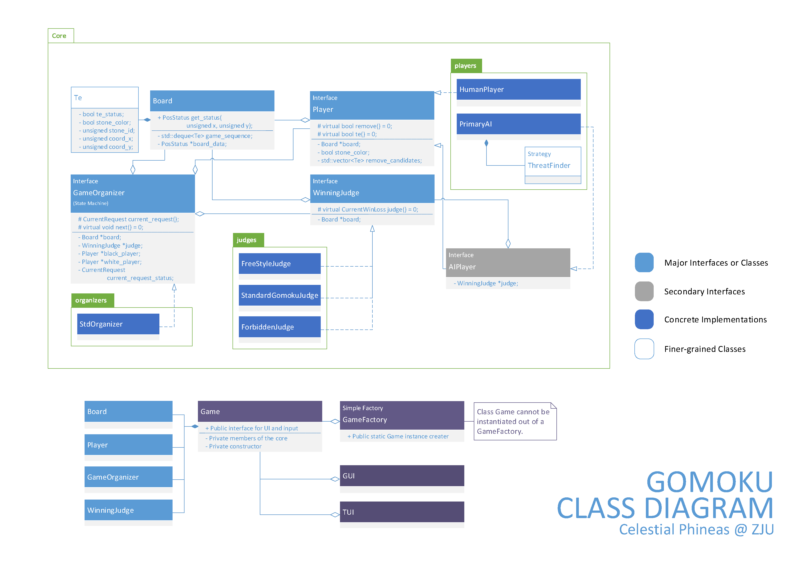

# Gomoku

This project implements a gomoku game (aka five-in-row), and serves as a homework project for object-oriented programming course of Zhejiang University.

## Release download

Check out [here](https://github.com/celestialphineas/gomoku/releases), for a compiled version of the project.

## Environment

The project is built under:

Qt version 5.8.0 (MSVC 2015, 32 bit)

Windows 10 Home 1703

Also passed a build on MacOS X.

## Class Diagram

Below shows a simplified version of class diagram.

## Contributors

Since not everyone has a good command of using git, some codes are merged manually. The commit history mostly shows contributions of the repo owner, however everyone has contributed a lot to this project.

* YIN Yehang   [@celestialphineas](https://github.com/celestialphineas)
* DENG Jie     [@Aliceeeeeee](https://github.com/Aliceeeeeee)
* CHEN Yulu    [@lulucici](https://github.com/lulucici)

## Know issues

Quite a lot. We have not enough time to fully test the program. The framework also provides some interfaces unimplemented in the GUI. 
